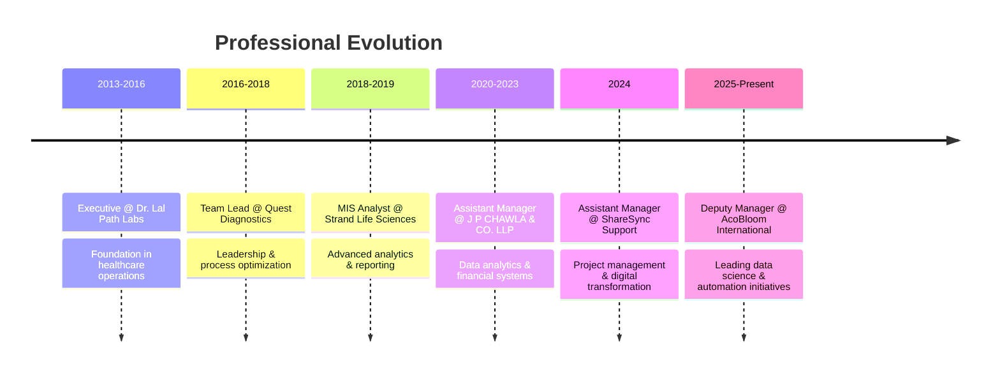

# Hey there, I'm Roshan 👋

<div align="center">

### Data Science Analyst | Digital Transformation Lead | Automation Architect

*Building intelligent systems that transform business operations—sometimes with ML models, sometimes with elegant if statements*

[](https://linkedin.com/in/bytsea)
[](mailto:roshan@bytsea.com)
[](https://bytsea.com)


</div>

---

## 🚀 About Me

```python
class Roshan:
    def __init__(self):
        self.role = "Data Science Analyst & Automation Strategist"
        self.experience = "10+ years driving digital transformation"
        self.mission = "Turning data into decisions, processes into automation"
        self.current_focus = [
            "Agentic AI Solutions",
            "Intelligent Automation",
            "Enterprise BI Systems",
            "MCP Server Integration"
        ]
    
    def daily_driver(self):
        tools = ["Python", "Power BI", "SQL", "Power Automate"]
        philosophy = "Automate the boring stuff, analyze the rest"
        return f"Building with {tools} | {philosophy}"
    
    def achievements_2024(self):
        return {
            "efficiency_gains": "40% operational improvement",
            "user_deployment": "240+ Co-Pilot users",
            "award": "Rising Star 2024 🌟",
            "automation_impact": "60% reduction in manual processes"
        }
```

---

## 🛠️ Technology Arsenal

### Core Stack
<table>
<tr>
<td valign="top" width="50%">

**Languages & Frameworks**
-  Expert in Pandas, NumPy, Scikit-learn
-  Advanced queries, optimization, complex joins
-  React, REST APIs, modern web
-  Enterprise automation & macros

</td>
<td valign="top" width="50%">

**Data & Analytics**
-  Executive dashboards & KPI tracking
-  Advanced modeling & automation
-  Data visualization expert
- **IBM Cognos** | Real-time analytics | MIS reporting

</td>
</tr>
<tr>
<td valign="top" width="50%">

**Automation & AI**
-  RPA workflows
- **OCR & ML Models** | Document intelligence
- **Agentic AI Solutions** | Intelligent agents
- **ZOHO Suite Integration** | Books, Sign, HRMS

</td>
<td valign="top" width="50%">

**Cloud & Infrastructure**
-  EC2, S3, cloud architecture
-  M365 admin & Co-Pilot deployment
-  Version control & CI/CD
-  Collaboration platforms

</td>
</tr>
</table>

---

## 💼 Career Journey



---

## 🎯 Impact Highlights

<div align="center">

| 🏆 Achievement | 📈 Impact | 🎯 Outcome |
|:---|:---:|---:|
| **Rising Star Award 2024** | Enterprise-wide recognition | Leadership in transformation |
| **RPA Implementation** | 40% efficiency gains | Reduced operational costs |
| **Co-Pilot Deployment** | 240+ users onboarded | Enhanced productivity |
| **Process Automation** | 60% manual reduction | Faster turnaround times |
| **Client Satisfaction** | 30% improvement | Better engagement scores |

</div>

---

## 🔥 Featured Projects

### 🎯 Client Engagement & Billing Platform
**Full-stack automation solution transforming client operations**
- **Stack:** Python • React • PostgreSQL • REST APIs
- **Features:** Real-time tracking, automated billing, workflow orchestration
- **Impact:** 30% boost in client satisfaction, eliminated billing errors

### 📊 Enterprise BI Dashboard Suite
**Unified analytics platform across 5 departments**
- **Stack:** Power BI • SQL • Python • Advanced DAX
- **Scope:** Sales, Marketing, HR, Finance, Operations
- **Impact:** 60% faster reporting, standardized KPI tracking

### 🤖 Intelligent Document Processing Pipeline
**ML-powered OCR system with agentic AI capabilities**
- **Stack:** Python • ML Models • OCR Tech • Agentic AI
- **Innovation:** Autonomous document classification and extraction
- **Impact:** 20-30% efficiency gains in document workflows

### 🔄 ZOHO ERP Integration Hub
**Seamless integration across Books, Sign, and HRMS**
- **Stack:** Python • ZOHO APIs • Power Automate
- **Features:** Automated data sync, real-time updates
- **Impact:** Eliminated manual data entry across systems

---

## 📊 GitHub Activity

<div align="center">


</div>

---

## 🎓 Continuous Learning

**Currently Exploring:**
- 🤖 Advanced Agentic AI architectures & MCP servers
- 🧠 Prompt engineering optimization techniques
- ⚡ Model fine-tuning and deployment strategies
- 🔗 Enterprise AI integration patterns

**Education & Certifications:**
- 🎓 MBA in Finance — Amity University (2020)
- 📜 Microsoft 365 Administration Specialist
- 🔧 Power Platform Solutions Expert
- 📊 Advanced Data Analytics Certification

---

## 🌐 Domain Expertise

<table>
<tr>
<td align="center" width="33%">

### 🏥 Healthcare & Diagnostics
Digital transformation<br/>
Operations optimization<br/>
Revenue analytics<br/>
Team training programs

</td>
<td align="center" width="33%">

### 💰 Finance & Accounting
Financial dashboards<br/>
Billing automation<br/>
Budget analytics<br/>
ERP implementation

</td>
<td align="center" width="33%">

### 🏢 Enterprise Technology
Digital transformation<br/>
System integration<br/>
Asset management<br/>
Process standardization

</td>
</tr>
</table>

---

## 🤝 Let's Collaborate

I'm passionate about working on projects involving:

- **🤖 Intelligent Automation** — RPA, AI-driven workflows, process optimization
- **📊 Advanced Analytics** — Predictive models, BI dashboards, data visualization
- **🔄 Digital Transformation** — System integration, modernization, change management
- **🚀 Innovation** — ML/AI solutions, agentic systems, cutting-edge tech

### 📬 Get in Touch

<div align="center">

[](mailto:roshan@bytsea.com)
[](https://linkedin.com/in/bytsea)
[](https://bytsea.com)

</div>

---

<div align="center">

### 💡 *"Transforming complex business challenges into scalable, automated solutions—one commit at a time"*

**⭐ If you find my work interesting, consider following or starring my repositories!**


</div>
