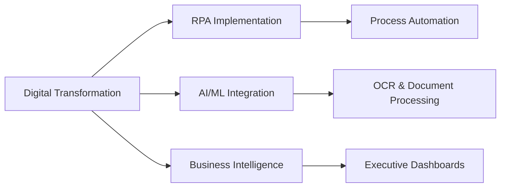

# Hi there, I'm Roshan 👋

## 🚀 Digital Transformation Lead | Automation Strategist | Data Science Analyst

> Transforming business operations through intelligent automation and data-driven solutions

[](https://linkedin.com/in/bytsea)
[](mailto:roshan@bytsea.com)
[](https://bytsea.com)

---

### 🎯 What I Do

```python
class DigitalTransformationLead:
    def __init__(self):
        self.name = "Roshan"
        self.role = "Data Science Analyst & Automation Strategist"
        self.experience = "10+ years"
        self.focus = ["RPA", "AI Automation", "Business Intelligence", "Process Optimization"]
        
    def current_mission(self):
        return "Driving operational efficiency through intelligent automation"
```

---

## 🛠️ Tech Stack & Tools

### **Programming & Scripting**


**Libraries & Frameworks:**
- **Python:** Pandas, NumPy, Scikit-learn, Matplotlib, Seaborn
- **Web:** React, HTML5, CSS3, REST APIs
- **Database:** PostgreSQL, MS Access, Complex Joins & Subqueries

### **Data Analytics & BI**


- **Dashboards:** Executive KPI Dashboards, Real-time Analytics
- **Reporting:** MIS Templates, Performance Analytics, Data Visualization
- **Tools:** IBM Cognos, Advanced Excel Macros, Custom BI Solutions

### **Automation & Integration**


- **RPA Platforms:** Power Apps, Power Automate, Custom Workflow Solutions
- **Integration:** ZOHO Suite (Books, Sign, HRMS), ERP Systems, CRM Integration
- **AI/ML:** OCR Technology, Agentic AI Solutions, ML Model Implementation

### **Cloud & DevOps**


- **AWS:** EC2, S3, Infrastructure Management
- **Microsoft 365:** Administration, Co-Pilot Deployment (240+ users)
- **Version Control:** Git, GitHub, GitLab

---

## 📊 GitHub Stats

<div align="center">
  


</div>

---

## 💼 Professional Highlights

### 🏆 **Recent Achievements**
- **🌟 Rising Star Award 2024** - Outstanding leadership in business operations transformation
- **📈 40% Operational Efficiency** - Through RPA and AI-driven automation implementation
- **👥 240+ Users** - Successfully deployed Microsoft Co-Pilot enterprise-wide
- **⚡ 60% Process Improvement** - Reduced manual intervention through Power Automate solutions

### 🎯 **Current Focus Areas**


---

## 🔥 Featured Projects

### 📱 **Client Engagement-Billing-Timesheet Application**
- **Tech Stack:** Python, React, SQL, REST APIs
- **Impact:** 30% improvement in client satisfaction scores
- **Features:** End-to-end workflow automation, real-time tracking, integrated billing

### 📊 **Enterprise BI Dashboard Suite** 
- **Tech Stack:** Power BI, SQL, Python automation scripts
- **Impact:** 60% faster report delivery, eliminated manual errors
- **Scope:** Sales, Marketing, HR, Finance, Operations standardization

### 🤖 **OCR-ML Document Processing Pipeline**
- **Tech Stack:** Python, ML Models, OCR Technology, Agentic AI
- **Impact:** 20-30% efficiency gains in document processing
- **Innovation:** Intelligent document classification and data extraction

---

## 📈 Experience Timeline

```
2025-Present  │ Data Science Analyst - Deputy Manager @ AcoBloom International
2024          │ Data & Project Analyst - Assistant Manager @ ShareSync Support
2020-2023     │ Data Analyst - Assistant Manager @ J P CHAWLA & CO. LLP
2018-2019     │ MIS Analyst - Senior Executive @ Strand Life Sciences
2016-2018     │ Team Lead @ Quest Diagnostics India
2013-2016     │ Executive @ Dr. Lal Path Labs
```

---

## 🌐 Domains of Expertise

<table>
<tr>
<td valign="top" width="33%">

### 🏥 **Healthcare & Diagnostics**
- Digital service rollouts
- Field operations optimization
- Revenue analytics
- Paramedical team training

</td>
<td valign="top" width="33%">

### 💰 **Finance & Accounting**
- Financial KPI dashboards
- Billing reconciliation
- Budget analysis
- ZOHO Books implementation

</td>
<td valign="top" width="33%">

### 🏢 **Corporate Technology**
- Digital transformation
- System integration
- Asset management
- Process standardization

</td>
</tr>
</table>

---

## 📚 Learning & Development

### **Currently Exploring**
- Advanced Agentic AI Solutions
- MCP Server Integration
- Prompt Engineering Optimization
- Model Fine-Tuning Techniques

### **Certifications & Education**
- 🎓 **MBA in Finance** - Amity University (2020)
- 📜 **Microsoft 365 Administration**
- 🔧 **Power Platform Specialist**

---

## 🤝 Let's Connect!

I'm always interested in collaborating on:
- 🤖 **Automation Projects** - RPA, AI-driven workflows
- 📊 **Data Analytics** - BI dashboards, predictive analytics  
- 🔄 **Digital Transformation** - Process optimization, system integration
- 🚀 **Innovation Projects** - ML models, intelligent automation

### 📫 **Reach Out:**
- 📧 Email: roshan@bytsea.com
- 💼 LinkedIn: [Connect with me](https://linkedin.com/in/bytsea)
- 🌐 Website: [bytsea.com](https://bytsea.com)


---

<div align="center">

### 💡 *"Transforming complex business challenges into scalable, automated solutions"*


</div>


<!---
excelblazer/excelblazer is a ✨ special ✨ repository because its `README.md` (this file) appears on your GitHub profile.
You can click the Preview link to take a look at your changes.
--->
